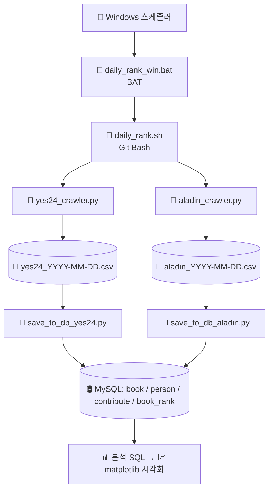

## 📚 도서 베스트셀러 수집 및 분석 시스템

국내 주요 서점(YES24, 알라딘)의 베스트셀러 데이터를 **자동 수집 → MySQL 저장 → SQL 분석 → 시각화**까지 이어지는 ETL 시스템 프로젝트입니다.

## 🔗 목차
1. [프로젝트 개요](#-프로젝트-개요)
2. [기술 스택](#-기술-스택)
3. [프로젝트 구조](#-프로젝트-구조)
4. [ERD 구조](#-ERD-구조)
5. [기능 설명](#-기능-설명)
6. [실행 방법](#-실행-방법)

---

### 📌 프로젝트 개요

* **목표**: 베스트셀러 도서 정보를 수집, 정제, 저장하여 분석 가능한 형태로 구성
* **주요 대상**: YES24 베스트셀러
* **구현 언어**: Python
* **DB**: MySQL
* **배포 방식**: 로컬 또는 추후 서버 자동화 스크립트

---

### 🛠 기술 스택

| 구분     | 기술                        |
| ------ | ------------------------- |
| 크롤링    | Selenium, BeautifulSoup   |
| 데이터 처리 | pandas                    |
| DB 연동  | pymysql, sqlalchemy       |
| 실행 환경  | Python 3.11.7 (Anaconda 기반) |

---

### 📁 프로젝트 구조

```
book-ranker-etl/
│
├── analysis/                  # 분석용 SQL 또는 시각화
│   ├── date_first_aladin.sql  # 날짜별 1위 분석 SQL (aladin)
│   ├── date_first_yes24.sql   # 날짜별 1위 분석 SQL (yes24)
│   └── top_author.sql         # TOP 20 중 가장 많은 저자 SQL
│ 
├── crawler/                   # 웹 크롤링 모듈
│   ├── aladin_crawler.sql   
│   └── yes24_crawler.py
│
├── data/                      # 수집된 CSV 데이터 저장 폴더
│   └── load_csv_save_db.py    # 공통 DB 저장 로직
│
├── db/                        # DB 연결 및 쿼리 관련 코드
│   ├── create_tables.sql      # 테이블 생성 SQL
│   ├── db_connector.py        # db 연결 모듈
│   ├── save_to_db_aladin.py
│   └── save_to_db_yes24.py
│
├── logs/                      # 로그 저장 폴더
│   
├── scheduler/                 # 자동화 스크립트 (로컬 실행용 .sh 등)
│   ├── daily_rank_win.bat
│   └── daily_rank.sh
|
├── test/                      # Test Code
│   └── yes24_crawler_test.sh          # crawler test
│
├── utils/                     # 커스텀 설정
│   ├── logger.py              # logger 설정
│   └── retry.py               # 재시도 설
│ 
├── visualizer/                # plot를 통한 시각화
│   ├── plot_date_first.sql    # 날짜별 1위 plot
│   └── plot_top_author.sql    # TOP 20 중 가장 많은 저자 plot
│
├── .gitignore                 
├── requirements.txt           # 필요 패키지 목록
└── README.md                  # 프로젝트 설명 파일
```

---

### 🎨 ERD 구조


---

### ✅ 기능 설명

* YES24 베스트셀러 도서 정보 크롤링 (제목, 저자, 출판사, 가격 등)
* 수집된 데이터를 `.csv`로 저장
* 중복 방지를 위한 DB 삽입 로직 포함
* 날짜별 랭킹 데이터 축적 가능



---

### 🔄 실행 방법

1. **환경 구성**

   ```bash
   pip install -r requirements.txt
   ```

2. **MySQL DB 테이블 생성**

   ```sql
   -- create_tables.sql 참고
   CREATE TABLE IF NOT EXISTS book (
       id INT AUTO_INCREMENT PRIMARY KEY,
       title VARCHAR(255) NOT NULL,
       publisher VARCHAR(255) NOT NULL,
       price INT NOT NULL
   );
   CREATE TABLE IF NOT EXISTS book_rank (
       id INT AUTO_INCREMENT PRIMARY KEY,
       book_id INT NOT NULL,
       book_rank INT NOT NULL,
       date_added DATE NOT NULL,
       FOREIGN KEY (book_id) REFERENCES book(id),
       UNIQUE KEY unique_book (book_id, date_added)
   );
   CREATE TABLE IF NOT EXISTS person (
       id INT AUTO_INCREMENT PRIMARY KEY,
       name VARCHAR(255) NOT NULL
   );
   CREATE TABLE IF NOT EXISTS contribute (
       id INT AUTO_INCREMENT PRIMARY KEY,
       person_id INT NOT NULL,
       book_id INT NOT NULL,
       book_role VARCHAR(255) NOT NULL,
       FOREIGN KEY (person_id) REFERENCES person(id),
       FOREIGN KEY (book_id) REFERENCES book(id)
   );
   ```

3. **크롤러 실행**

   ```bash
   python -m crawler.yes24_crawler
   ```

4. **자동화 스크립트 실행**

   ```bash
   ./scheduler/run_daily.sh
   ```

---

### ⚠️ 예외 처리

* 브라우저 창 오류 또는 셀레니움 비정상 종료 대비 `try-except` 문 적용
* 중복 도서 정보는 DB에서 무시되도록 설정 (UNIQUE 제약)
